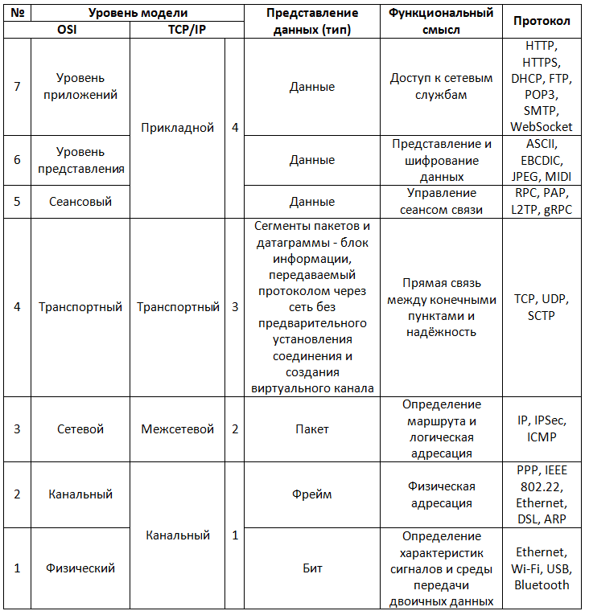

## 02-Network

## 2-1-Основы-сетей-osi-tcp-ip-udp

📗**Материалы**:

---

### 🔹Модель OSI | TCP/IP

  
<b>Наглядная схема моделей OSI и TCP/IP</b>

  ---

  

---

### 🔹TCP/IP и UDP

<b><u>TCP/IP – это стек сетевых протоколов, где IP отвечает за адресацию и маршрутизацию, TCP – за надёжную передачу данных.</b></u>

---

**📜IP (Internet Protocol) – протокол межсетевой адресации и маршрутизации** (сетевой уровень OSI / межсетевой TCP/IP). Обеспечивает **адресацию и передачу данных** между устройствами в сети. Он определяет, **куда** должен быть отправлен пакет и **как** он дойдёт до получателя.

**Основные функции IP:**

**1. Адресация устройств.** Каждое устройство в сети получает **уникальный IP-адрес**, по которому его можно идентифицировать. В глобальной сети два устройства **не могут иметь один и тот же IP-адрес**, иначе возникнет конфликт.

**2. Маршрутизация.** IP-пакеты передаются через маршрутизаторы, которые анализируют IP-адрес получателя и определяют **оптимальный маршрут** для их доставки.

**3. Фрагментация и сборка пакетов.** Если размер пакета превышает MTU (**Maximum Transmission Unit**), он **разбивается** на более мелкие части и затем собирается у получателя.

**4. Отсутствие гарантий доставки.** IP передаёт пакеты **без подтверждения** и **без контроля их порядка**. Поэтому для надёжной связи используется TCP, который добавляет контроль целостности.

---

**📜TCP (Transmission Control Protocol)** – протокол транспортного уровня (транспортный уровень OSI / транспортный уровень TCP/IP), контролирует передачу данных, гарантируя их **целостность, порядок доставки и отсутствие потерь.**

**Основные функции TCP:**

Передача данных начинается с трехстороннего рукопожатия (3-way handshake):

- Клиент отправляет `SYN` (запрос соединения).

- Сервер отвечает `SYN-ACK` (подтверждение).

- Клиент подтверждает `ACK`, соединение установлено.

---

📌**Как это работает?** **IP** строит маршрут, **TCP** следит за корректной передачей. Вместе они обеспечивают стабильное соединение в интернете.

---

**📜UDP (User Datagram Protocol)** – протокол транспортного уровня (транспортный уровень OSI / транспортный уровень TCP/IP), обеспечивает **быструю отправку сообщений без установления соединения**, не гарантируя порядок доставки или целостность данных. Используется там, где важна скорость, а не надежность (например, потоковое видео или онлайн-игры)

**Как работает UDP?**

**1. Отправка датаграмм.** Отправитель формирует UDP-дейтаграмму (пакет), добавляет к ней заголовок и отправляет в сеть.

**2. Передача по сети.** Данные передаются от узла к узлу без установления соединения.

**3. Доставка получателю (или потеря).** Получатель получает датаграмму, но:

- Они могут приходить **в разном порядке**

- Некоторые могут **не дойти вовсе**

- Нет механизма **подтверждения доставки**

---

