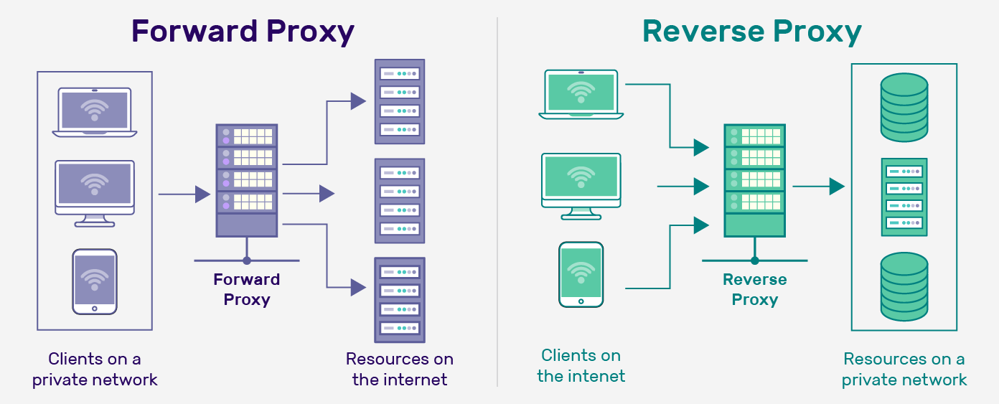
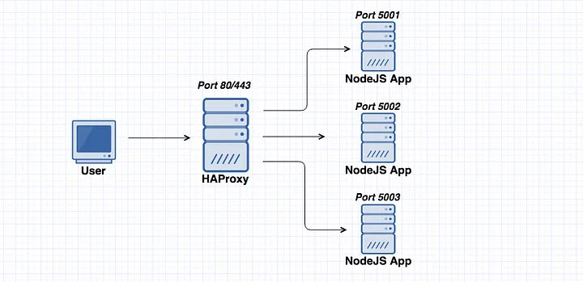

## 02-Network

## 2-5-Основы-сетей-vpn-proxy

📗**Материалы:**

---

## 2-5-Основы-сетей-vpn-proxy

📜<b>Proxy (forward, reverse, load balancing)</b>

---

**Proxy** — это промежуточный сервер между клиентом и целевым ресурсом. Запросы сначала идут на прокси, а он уже перенаправляет их дальше.  

🔹**Зачем нужен:** анонимизация, кэширование, балансировка нагрузки, защита инфраструктуры.  

---

## Типы прокси по направлению проксируемого трафика

**1) Прямой прокси (Forward Proxy)** обслуживает **клиента** и скрывает его данные от внешних серверов.

**Место расположения**: Он располагается между клиентом (пользователем) и интернет-ресурсом (сервером)

**Задача**: Направляет запросы от клиента к целевому серверу. То есть, он работает от имени клиента, скрывая его настоящие IP-адрес и другие данные.

---

**Как работает:**

- Прямой прокси действует от имени клиентов, перенаправляя их запросы в интернет или другую сеть.

- Сервер, на который идет запрос, видит IP-адрес прокси, а не клиента.

---

**Пример использования:**

- Обход ограничений (например, доступ к заблокированным сайтам).

- Анонимизация трафика (скрытие IP-адреса клиента).

- Кэширование данных для ускорения доступа.

**Популярные инструменты:** Squid, 3proxy, TinyProxy.

---

**2) Обратный прокси (Reverse Proxy)** обслуживает **сервер** и скрывает данные о серверной инфраструктуре от клиентов.

**Место расположения**: Он находится между пользователем и сервером, к которому они пытаются подключиться. Прокси-сервер управляет запросами от клиентов и перенаправляет их на внутренние серверы.

**Задача**: Направляет запросы от пользователей к одному или нескольким внутренним серверам. Он не скрывает IP-адрес клиента, а наоборот — обрабатывает запросы от всех пользователей и передаёт их на внутренние ресурсы.

---

**Как работает:**

- Обратный прокси принимает запросы от клиентов и перенаправляет их на один или несколько серверов, находящихся за ним.

- Клиент не знает, куда именно идет запрос, так как обратный прокси скрывает внутреннюю инфраструктуру.

---

**Пример использования:**

- Балансировка нагрузки между несколькими серверами.

- Кэширование статических ресурсов.

- Защита серверов от прямого доступа из интернета.

**Популярные инструменты:**

- Nginx, Apache (mod_proxy), HAProxy.

---

**3) Прокси для балансировки нагрузки (Load Balancer)** распределяет запросы между несколькими серверами для балансировки нагрузки и повышения производительности. Это часто используется в крупных веб-приложениях или сервисах с высокой нагрузкой.

**Как работает:**

- Распределяет запросы между несколькими серверами для повышения производительности и отказоустойчивости.

---

**Пример использования:**

- Распределение нагрузки на веб-сервера.

- Обеспечение высокой доступности сервисов.

**Популярные инструменты:**

- HAProxy, Nginx, Apache (mod_proxy_balancer).

---

📜<b>VPN (Virtual Private Network)</b>

---

**VPN** — это технология, которая шифрует соединение и создаёт **туннель между клиентом и сервером** поверх публичной сети.  

🔹**Как работает:**  
- Клиент шифрует трафик  
- Трафик идёт по туннелю до VPN-сервера  
- Сервер расшифровывает и пересылает в подсеть или интернет  

---

**Основные протоколы VPN:**
- **IPSec** — защищённый на сетевом уровне  
- **OpenVPN** — популярный, кроссплатформенный  
- **WireGuard** — современный, быстрый, с минимальным кодом  
- **L2TP/PPTP** — устаревшие, почти не применяются  

Split-tunneling (раздельная маршрутизация):
Позволяет направлять через VPN **только часть трафика**, а остальное — напрямую.  

> Например: весь трафик в `10.0.0.0/8` идёт через VPN, а обычный интернет — без него.  

Используется для экономии трафика и ускорения работы.  

