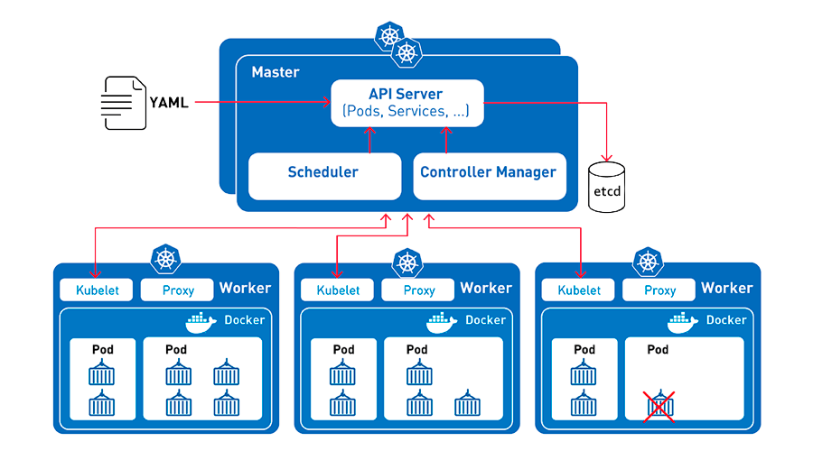

# 📚5-1-Архитектура-Kubernetes
>Установка собственного кластера Kubernetes: настройка master и worker-нод, запуск сетевого плагина и подключение Dashboard для управления через веб-интерфейс.


📗**Материалы:**
- [Kubernetes — Простым Языком на Понятном Примере [YouTube.com]](https://www.youtube.com/watch?v=TwyhnBDOHPw)

---


<details>
<summary><b>🏗️Общая архитектура</b></summary>

---

Архитектура Kubernetes проще, чем кажется - вы **не взаимодействуете напрямую с нодами**. Вся работа осуществляется через:

- **Dashboard** - веб-панель управления
- **API** - программный интерфейс  
- **kubectl** - инструмент командной строки



---

## 🎯Control Plane (Master Node) - управляющие узлы

Запускают компоненты управления:

- **kube-apiserver** - API-сервер
- **kube-scheduler** - планировщик
- **kube-controller-manager** - менеджер контроллеров
- **etcd** - хранилище данных кластера

---

## ⚙️Worker Nodes - рабочие узлы

Запускают приложения и дополнительные компоненты:

- **kube-proxy** - маршрутизация трафика
- **kubelet** - выполнение инструкций от мастера
- **Плагины** - сетевое взаимодействие, мониторинг
- **Контейнеры** - docker/rkt с приложениями

---

</details>

<details>
<summary><b>🧱Основные ресурсы</b></summary>

---

Ресурсы Kubernetes - это **строительные блоки** для запуска приложений в кластере.

### 🎯Основные объекты управления

#### Pods
- **Минимальная сущность** для развертывания
- Один или несколько контейнеров
- Общие сеть и хранилище

#### ReplicaSets
- **Гарантирует количество** запущенных Pod'ов
- Замена Replication Controller
- Самовосстановление при сбоях

#### Deployments
- **Декларативные обновления** Pod'ов и ReplicaSets
- История изменений и откат
- Рекомендуемый способ управления приложениями

#### StatefulSets
- Для приложений **с сохранением состояния**
- Устойчивые идентификаторы и хранилище
- Базы данных, кэши

#### DaemonSet
- **По одному Pod'у на ноде**
- Агенты мониторинга, логгирования
- Обязательные сервисы на каждой ноде

#### Jobs/CronJob
- **Задачи с завершением**
- Одноразовые или периодические задания
- Миграции БД, обработка данных

---

### 🏷️Организация и идентификация

#### Labels and Selectors
```yaml
metadata:
  labels:
    app: frontend
    tier: web
```

- **Пары ключ/значение** для идентификации объектов
- **Селекторы** для поиска и группировки

#### Namespaces
```bash
kubectl create namespace development
kubectl get pods -n development
```

- **Виртуальные кластеры** в физическом кластере
- Изоляция сред (dev/staging/prod)
- Разделение доступа между командами

---

### 🌐Сеть и конфигурация

#### Services
- **Абстракция доступа** к набору Pod'ов
- Балансировка нагрузки
- Постоянный IP и DNS-имя

#### Annotations
```yaml
metadata:
  annotations:
    description: "Production database"
    version: "2.1"
```

- **Произвольные метаданные**
- Информация для инструментов
- Не для идентификации

#### ConfigMaps
- **Внешняя конфигурация** приложений
- Отделение конфига от образов
- Переопределение параметров

#### Secrets
```yaml
apiVersion: v1
kind: Secret
metadata:
  name: db-secret
type: Opaque
data:
  password: cGFzc3dvcmQ=
```

- **Хранение конфиденциальной информации**
- Пароли, токены, SSH-ключи
- Безопасное распределение секретов

---

</details>

<details>
<summary><b>🛠️Взаимодействие с кластером</b></summary>

---

### Основные команды kubectl

```bash
# Просмотр ресурсов
kubectl get pods
kubectl get deployments
kubectl get services

# Создание ресурсов
kubectl create -f deployment.yaml
kubectl apply -f configmap.yaml

# Управление приложениями
kubectl scale deployment frontend --replicas=5
kubectl rollout status deployment/backend
```

---

</details>

<details>
<summary><b>✅Декларативный подход</b></summary>

---

Вместо последовательности команд описываем **желаемое состояние**:

```yaml
apiVersion: apps/v1
kind: Deployment
metadata:
  name: nginx-deployment
spec:
  replicas: 3
  template:
    spec:
      containers:
      - name: nginx
        image: nginx:1.20
```

Kubernetes сам приведет текущее состояние к желаемому.

---

</details>

<details>
<summary><b>💡Ключевые принципы для запоминания</b></summary>

---

1. **✅Декларативность** - описываем "что", а не "как"
2. **✅Самовосстановление** - автоматическое поддержание состояния  
3. **✅Масштабируемость** - легко увеличить/уменьшить нагрузку
4. **✅Переносимость** - одинаково работает везде
5. **✅Модульность** - компоненты независимы и заменяемы

---

</details>

<details>
<summary><b>🎯Что важно понять новичку</b></summary>

---

- **🔹Pods** - базовые "кирпичики" приложений
- **🚀Deployments** - основной способ управления
- **🌐Services** - как приложения общаются между собой  
- **📁Namespaces** - организация и изоляция
- **⚡kubectl** - основной инструмент управления

> 💡**Совет:** Не пытайтесь запомнить все сразу! Начинайте с Pods → Deployments → Services, остальное придет с практикой.

</details>