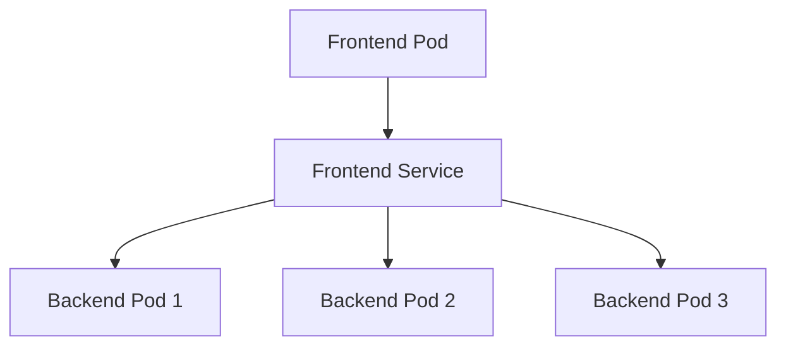
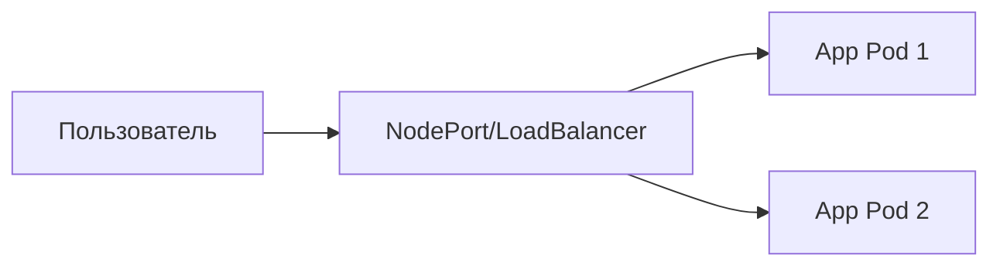
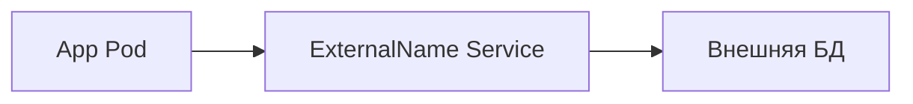

# 🌐5-5-Сеть-и-сервисы-Services

<details>
<summary><b>🎯Что такое Service?</b></summary>

---

### Проблема "смертности" Pod'ов

Pods в Kubernetes **эфемерны** - они создаются, но когда Pod умирает, он не воскресает. Каждый Pod получает свой IP-адрес, но этот адрес **не постоянен** и **не стабилен**.

**Пример проблемы:**
- ReplicaSet может масштабировать количество Pod'ов
- Новые Pod'ы запускаются на других нодах → IP меняется
- Как frontend Pod'ам найти backend Pod'ы?

### Решение: Service

Service - это абстракция, которая определяет:
- **Логический набор Pod'ов** (микросервис)
- **Политику доступа** к ним
- **Стабильную точку доступа**

**Пример:** 3 backend Pod'а для обработки изображений
- Frontend не должен беспокоиться о конкретном backend Pod'е
- Service обеспечивает балансировку нагрузки

---

</details>

<details>
<summary><b>📋Базовый пример Service</b></summary>

---

```yaml
kind: Service
apiVersion: v1
metadata:
  name: my-service
spec:
  selector:
    app: MyApp
  ports:
  - protocol: TCP
    port: 80
    targetPort: 9376
```

### Как это работает:

1. **Создается Service** `my-service`
2. **Селектор** `app: MyApp` находит все Pod'ы с этой меткой
3. **Перенаправление** порта 80 → порт 9376 на Pod'ах
4. **Service получает стабильный IP-адрес**

### Механизм Endpoints

Kubernetes автоматически создает объект **Endpoints**:
- Непрерывно проверяет Pod'ы по селектору
- Публикует список IP-адресов Pod'ов в Endpoints
- Service использует эти Endpoints для маршрутизации

---

</details>

<details>
<summary><b>🔧Конфигурация портов</b></summary>

---

### Варианты настройки портов:

#### Базовый вариант:
```yaml
ports:
- protocol: TCP
  port: 80        # Порт Service
  targetPort: 9376 # Порт Pod'а
```

#### Использование имен портов:
```yaml
ports:
- name: http
  protocol: TCP
  port: 80
  targetPort: web-api  # Имя порта в Pod
```

В Pod'е:
```yaml
ports:
- name: web-api
  containerPort: 9376
```

#### Множественные порты:
```yaml
ports:
- name: http
  protocol: TCP
  port: 80
  targetPort: 9376
- name: https
  protocol: TCP
  port: 443
  targetPort: 9377
```

</details>

<details>
<summary><b>🌐Типы Service (ServiceTypes)</b></summary>

---

### ClusterIP (по умолчанию)
```yaml
spec:
  type: ClusterIP
  # или не указывать - используется по умолчанию
```
- **Доступ только внутри кластера**
- Внутренний IP-адрес кластера
- Идеален для связи между микросервисами

### NodePort
```yaml
spec:
  type: NodePort
  ports:
  - port: 80
    targetPort: 9376
    nodePort: 30080  # опционально
```
- **Доступ снаружи кластера**
- Открывает порт на каждой ноде (30000-32767)
- Автоматически создает ClusterIP
- URL: `<NodeIP>:<NodePort>`

### LoadBalancer
```yaml
spec:
  type: LoadBalancer
```
- **Облачный балансировщик нагрузки**
- Автоматически создает NodePort + ClusterIP
- Интеграция с облачными провайдерами (AWS, GCP, Azure)

### ExternalName
```yaml
spec:
  type: ExternalName
  externalName: foo.bar.example.com
```
- **CNAME запись для внешнего сервиса**
- Без проксирования
- Для интеграции с внешними системами

---

</details>

<details>
<summary><b>🔗Service без селектора</b></summary>

---

### Когда использовать:

- Внешний кластер баз данных
- Сервис в другом namespace или кластере
- Системы вне Kubernetes (миграция)

### Пример Service без селектора:
```yaml
kind: Service
apiVersion: v1
metadata:
  name: my-service
spec:
  ports:
  - protocol: TCP
    port: 80
    targetPort: 9376
```

### Ручное создание Endpoints:
```yaml
kind: Endpoints
apiVersion: v1
metadata:
  name: my-service  # Должно совпадать с Service
subsets:
  - addresses:
      - ip: 1.2.3.4  # Внешний IP
    ports:
      - port: 9376
```

**Ограничения:** IP не может быть в диапазонах:
- 127.0.0.0/8
- 169.254.0.0/16  
- 224.0.0.0/24

---

</details>

<details>
<summary><b>🛠️Практическая работа</b></summary>

---

### Создание Service:

```bash
kubectl apply -f service.yaml
```

### Просмотр Service:

```bash
kubectl get services
kubectl describe service my-service
```

### Просмотр Endpoints:

```bash
kubectl get endpoints
kubectl describe endpoints my-service
```

### Тестирование доступа:

```bash
# Изнутри кластера
kubectl run test-pod --image=busybox --rm -it -- sh
# Внутри Pod'а:
wget -O- http://my-service:80
```

### Для NodePort:

```bash
# Получить NodePort
kubectl get service my-service

# Доступ снаружи
curl http://<node-ip>:<node-port>
```

---

</details>

<details>
<summary><b>💡Паттерны использования</b></summary>

---

## 1. Внутренняя коммуникация

- **ClusterIP** для связи между микросервисами
- Балансировка нагрузки между репликами

## 2. Внешний доступ к приложению

- **NodePort** для разработки/тестирования
- **LoadBalancer** для продакшена в облаке

## 3. Интеграция с внешними системами

- **ExternalName** для постепенной миграции
- **Service без селектора** для гибридных сред

---

</details>

</details><details> <summary><b>🎯Ключевые выводы</b></summary>

---

1. **Service решает проблему "смертности" Pod'ов** - предоставляет стабильный endpoint

2. **Селекторы меток** - основной механизм связывания Service с Pod'ами

3. **Автоматические Endpoints** - Kubernetes сам отслеживает изменения Pod'ов

4. **Multiple ServiceTypes** - разные сценарии доступа (внутренний/внешний)

5. **Гибкая настройка портов** - имена портов, множественные порты

6. **Внешние бэкенды** - через Service без селектора + ручные Endpoints

>💡**Совет:** Начинайте с ClusterIP для внутренних сервисов, используйте NodePort для разработки, переходите на LoadBalancer для продакшена.