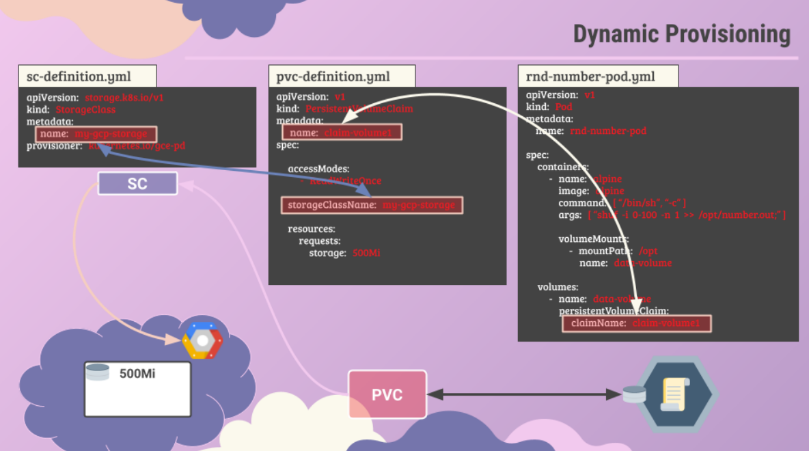

[🏠 Главная](../../README.md) → [☸️ Container-Orchestration](../../README.md#-container-orchestration) → [💾 K-12-Хранение](../../README.md#-k-12-хранение)

---

# 💾K-12-8-Storage-Classes
>Storage Classes в Kubernetes: динамическая подготовка томов, provisioners, параметры хранилища, типы дисков и репликация

---

<details>
<summary><b>📚Введение: Проблема статической подготовки томов</b></summary>

---

## Связь с предыдущей темой

В теме [K-12-7-Persistent-Volume-Claims](K-12-7-Persistent-Volume-Claims.md) мы рассмотрели создание Persistent Volume Claims для подключения к существующим Persistent Volumes.

Теперь изучим Storage Classes — механизм автоматической подготовки хранилища при создании PVC.

---

## Static Provisioning (Статическая подготовка томов)

В предыдущих темах мы обсуждали процесс создания Persistent Volume, затем создания Persistent Volume Claim для подключения к этому хранилищу, и использования PVC в определениях Pods в качестве volumes.

### Пример статической подготовки

```yaml
# 1. Администратор создает PV для Google Persistent Disk
apiVersion: v1
kind: PersistentVolume
metadata:
  name: pv-volume1
spec:
  capacity:
    storage: 1Gi
  accessModes:
    - ReadWriteOnce
  gcePersistentDisk:
    pdName: my-disk
    fsType: ext4
```

```yaml
# 2. Пользователь создает PVC
apiVersion: v1
kind: PersistentVolumeClaim
metadata:
  name: claim-volume1
spec:
  accessModes:
    - ReadWriteOnce
  resources:
    requests:
      storage: 500Mi
```

### Проблема статической подготовки

Перед созданием PVC необходимо:

1. Вручную подготовить диск в Google Cloud (`gcloud compute disks create`)
2. Вручную создать файл определения PersistentVolume с указанием имени созданного диска
3. Повторять этот процесс для каждого нового запроса на хранилище

Этот подход называется **Static Provisioning (статической подготовкой томов)** и требует ручного вмешательства администратора при каждом запросе хранилища.

---

</details>

<details>
<summary><b>🔄Dynamic Provisioning (Динамическая подготовка томов)</b></summary>

---

## Автоматическая подготовка хранилища

Было бы удобно, если бы volume подготавливался автоматически при создании PVC, без необходимости предварительного создания диска и PV.

Именно для этого предназначены **Storage Classes**

### Что такое Storage Class

Storage Class — это объект Kubernetes, который определяет:

- **Provisioner** — компонент, который автоматически создает хранилище и PV при создании PVC
- **Параметры хранилища** — тип диска, репликация, производительность и другие характеристики

### Схема Dynamic Provisioning

<div align="left">
  
</div>

---

</details>

<details>
<summary><b>⚙️Создание Storage Class</b></summary>

---

## Определение Storage Class

Storage Class создается как объект Kubernetes с `apiVersion: storage.k8s.io/v1` и `kind: StorageClass`.

### Базовый пример

```yaml
apiVersion: storage.k8s.io/v1
kind: StorageClass
metadata:
  name: fast-ssd
provisioner: kubernetes.io/gce-pd
parameters:
  type: pd-ssd
  replication-type: regional
```

### Поля определения

- **`metadata.name`** — имя Storage Class, которое будет использоваться в PVC
- **`provisioner`** — компонент, который обрабатывает создание PV для новых PVC
- **`parameters`** — дополнительные параметры, специфичные для каждого provisioner

### Схема работы Storage Class

```
┌─────────────────────────────────────────────────────────┐
│  Pod с volume                                           │
│  ┌──────────────────────────────────────────────────┐   │
│  │  volumes:                                        │   │
│  │    - name: data-volume                           │   │
│  │      persistentVolumeClaim:                      │   │
│  │        claimName: claim-volume1                  │   │
│  └──────────────────────────────────────────────────┘   │
│                        │                                │
│                        ▼                                │
│  ┌──────────────────────────────────────────────────┐   │
│  │  PVC (claim-volume1)                             │   │
│  │  ┌─────────────────────────────────────────────┐ │   │
│  │  │  storageClassName: fast-ssd                 │ │   │
│  │  │  resources:                                 │ │   │
│  │  │    requests:                                │ │   │
│  │  │      storage: 10Gi                          │ │   │
│  │  └─────────────────────────────────────────────┘ │   │
│  └──────────────────────────────────────────────────┘   │
│                        │                                │
│                        ▼                                │
│  ┌──────────────────────────────────────────────────┐   │
│  │  Storage Class (fast-ssd)                        │   │
│  │  ┌─────────────────────────────────────────────┐ │   │
│  │  │  provisioner: kubernetes.io/gce-pd          │ │   │
│  │  │  parameters:                                │ │   │
│  │  │    type: pd-ssd                             │ │   │
│  │  │    replication-type: regional               │ │   │
│  │  └─────────────────────────────────────────────┘ │   │
│  └──────────────────────────────────────────────────┘   │
│                        │                                │
│                        ▼                                │
│  ┌──────────────────────────────────────────────────┐   │
│  │  PV создается автоматически                      │   │
│  │  (больше не нужно создавать вручную)             │   │
│  └──────────────────────────────────────────────────┘   │
└─────────────────────────────────────────────────────────┘
```

---

</details>

<details>
<summary><b>🔗Использование Storage Class в PVC</b></summary>

---

## Указание Storage Class в PVC

Чтобы PVC использовала определенный Storage Class, необходимо указать параметр `storageClassName` в определении PVC.

### Пример PVC с Storage Class

```yaml
apiVersion: v1
kind: PersistentVolumeClaim
metadata:
  name: claim-volume1
spec:
  storageClassName: fast-ssd  # Указываем имя Storage Class
  accessModes:
    - ReadWriteOnce
  resources:
    requests:
      storage: 10Gi
```

### Процесс создания

Когда создается PVC с указанным `storageClassName`:

1. Kubernetes находит соответствующий Storage Class
2. Storage Class использует указанный provisioner для подготовки нового диска требуемого размера в облачном провайдере
3. Provisioner создает PV автоматически
4. PVC привязывается к созданному PV

### Важно

Storage Class по-прежнему создает PV, но это происходит автоматически. Администратору больше не нужно вручную создавать PV для каждого запроса хранилища.

---

</details>

<details>
<summary><b>🔗Volume Binding Mode (Режим привязки томов)</b></summary>

---

## Volume Binding Mode

`volumeBindingMode` определяет, когда происходит привязка (binding) Persistent Volume Claim к Persistent Volume.

### Доступные режимы

#### Immediate (Немедленная привязка)

При создании PVC сразу происходит:
1. Создание PV (если используется dynamic provisioning)
2. Привязка PVC к PV

**Характеристики:**
- ✅ Быстрая привязка
- ✅ PVC сразу готова к использованию
- ❌ PV может быть создан на ноде, где Pod не может быть запланирован
- ❌ Для local storage может привести к проблемам с планированием Pod

**Схема Immediate:**

```
┌─────────────────────────────────────────────────────────┐
│  1. Создание PVC                                         │
│  ┌──────────────────────────────────────────────────┐   │
│  │  PVC: claim-volume1                              │   │
│  │  storageClassName: fast-ssd                      │   │
│  └──────────────────────────────────────────────────┘   │
│                        │                                │
│                        ▼                                │
│  2. Немедленное создание PV и привязка                  │
│  ┌──────────────────────────────────────────────────┐   │
│  │  PV создан на Node 1                             │   │
│  │  PVC → PV (Bound)                                │   │
│  └──────────────────────────────────────────────────┘   │
│                        │                                │
│                        ▼                                │
│  3. Pod может быть запланирован на любую ноду          │
│  ┌──────────────────────────────────────────────────┐   │
│  │  Pod запланирован на Node 2                      │   │
│  │  ⚠️ Проблема: PV на Node 1, Pod на Node 2        │   │
│  └──────────────────────────────────────────────────┘   │
└─────────────────────────────────────────────────────────┘
```

**Пример:**

```yaml
apiVersion: storage.k8s.io/v1
kind: StorageClass
metadata:
  name: fast-ssd
provisioner: kubernetes.io/gce-pd
volumeBindingMode: Immediate
parameters:
  type: pd-ssd
```

#### WaitForFirstConsumer (Ожидание первого потребителя)

Привязка происходит только после того, как Pod, использующий PVC, будет запланирован на конкретную ноду.

**Характеристики:**
- ✅ PV создается на той же ноде, где запланирован Pod
- ✅ Идеально для local storage
- ✅ Оптимизация размещения томов
- ⚠️ PVC остается в состоянии Pending до создания Pod

**Схема WaitForFirstConsumer:**

```
┌─────────────────────────────────────────────────────────┐
│  1. Создание PVC                                         │
│  ┌──────────────────────────────────────────────────┐   │
│  │  PVC: claim-volume1                              │   │
│  │  storageClassName: local-storage                 │   │
│  │  Status: Pending (ожидание)                      │   │
│  └──────────────────────────────────────────────────┘   │
│                        │                                │
│                        ▼                                │
│  2. Создание Pod с использованием PVC                   │
│  ┌──────────────────────────────────────────────────┐   │
│  │  Pod запланирован на Node 1                       │   │
│  └──────────────────────────────────────────────────┘   │
│                        │                                │
│                        ▼                                │
│  3. Создание PV на той же ноде и привязка              │
│  ┌──────────────────────────────────────────────────┐   │
│  │  PV создан на Node 1                             │   │
│  │  PVC → PV (Bound)                                 │   │
│  │  Pod → Node 1 ✓                                   │   │
│  └──────────────────────────────────────────────────┘   │
└─────────────────────────────────────────────────────────┘
```

**Пример:**

```yaml
apiVersion: storage.k8s.io/v1
kind: StorageClass
metadata:
  name: local-storage
provisioner: kubernetes.io/no-provisioner
volumeBindingMode: WaitForFirstConsumer
allowVolumeExpansion: false
```

### Сравнение режимов

| Характеристика | Immediate | WaitForFirstConsumer |
|----------------|-----------|---------------------|
| **Время привязки** | Сразу при создании PVC | После планирования Pod |
| **Состояние PVC** | Сразу Bound | Pending до создания Pod |
| **Размещение PV** | Может быть на любой ноде | На той же ноде, что и Pod |
| **Local storage** | ❌ Не рекомендуется | ✅ Рекомендуется |
| **Облачное хранилище** | ✅ Подходит | ✅ Подходит |
| **Оптимизация** | Средняя | Высокая |

### Когда использовать

**Immediate:**
- Облачные хранилища (AWS EBS, GCP Persistent Disk, Azure Disk)
- Когда нужна немедленная доступность PVC
- Когда не важно, на какой ноде будет создан PV

**WaitForFirstConsumer:**
- Local storage (локальные диски на нодах)
- Когда важно, чтобы PV был на той же ноде, что и Pod
- Для оптимизации производительности и снижения сетевых задержек

---

</details>

<details>
<summary><b>💻Provisioners локальные</b></summary>

---

## Локальные provisioners

Локальные provisioners используют диски, физически расположенные на нодах кластера.

> **📖 Подробнее о Access Modes:** Подробный разбор режимов доступа (ReadWriteOnce, ReadOnlyMany, ReadWriteMany) с примерами и схемами доступен в разделе [🔧Access Modes (Режимы доступа)](K-12-6-Persistent-Volumes.md#access-modes-режимы-доступа) файла K-12-6-Persistent-Volumes.md.

### Примеры Storage Classes для локальных provisioners

#### Local Storage (no-provisioner)
- **`kubernetes.io/no-provisioner`** — Local Storage (локальные диски на нодах)
- 🔧 **Тип:** Статический (требует ручного создания PV)
- 📦 **Хранилище:** Блочное (Block Storage)
- 🔐 **Access Modes:** ReadWriteOnce
- 🔄 **Репликация:** Нет (данные привязаны к ноде)
- ⚡ **Производительность:** Очень высокая (локальный доступ)
- 🛠️ **Расширение томов:** Зависит от конфигурации
- 🎯 **Использование:** Продакшен (базы данных, кэши, высокопроизводительные приложения)

```yaml
apiVersion: storage.k8s.io/v1
kind: StorageClass
metadata:
  name: local-storage
provisioner: kubernetes.io/no-provisioner
volumeBindingMode: WaitForFirstConsumer
allowVolumeExpansion: false
```

#### Local Path Provisioner
- **`rancher.io/local-path`** — Local Path Provisioner (Rancher)
- 🔧 **Тип:** Динамический (автоматически создает PV)
- 📦 **Хранилище:** Файловое (File Storage)
- 🔐 **Access Modes:** ReadWriteOnce
- 🔄 **Репликация:** Нет (данные привязаны к ноде)
- ⚡ **Производительность:** Высокая (локальный доступ)
- 🛠️ **Расширение томов:** Не поддерживается
- 🎯 **Использование:** Домашние лаборатории, разработка, тестирование

```yaml
apiVersion: storage.k8s.io/v1
kind: StorageClass
metadata:
  name: local-path
provisioner: rancher.io/local-path
volumeBindingMode: WaitForFirstConsumer
reclaimPolicy: Delete
```

#### OpenEBS LocalPV
- **`openebs.io/local`** — OpenEBS LocalPV
- 🔧 **Тип:** Динамический (автоматически создает PV)
- 📦 **Хранилище:** Блочное (Block Storage)
- 🔐 **Access Modes:** ReadWriteOnce
- 🔄 **Репликация:** Нет (данные привязаны к ноде)
- ⚡ **Производительность:** Высокая (локальный доступ)
- 🛠️ **Расширение томов:** Поддерживается
- 🎯 **Использование:** Продвинутые лаборатории, продакшен с локальными дисками

```yaml
apiVersion: storage.k8s.io/v1
kind: StorageClass
metadata:
  name: openebs-hostpath
provisioner: openebs.io/local
volumeBindingMode: WaitForFirstConsumer
allowVolumeExpansion: true
```

---

</details>

<details>
<summary><b>☁️Provisioners облачные</b></summary>

---

## Облачные provisioners

Облачные provisioners используют хранилище, предоставляемое облачными провайдерами.

### Примеры Storage Classes для облачных провайдеров

#### Google Cloud
- **`kubernetes.io/gce-pd`** — Google Cloud Persistent Disk
- 🔧 **Тип:** Динамический (автоматически создает PV)
- 📦 **Хранилище:** Блочное (Block Storage)
- 🔐 **Access Modes:** ReadWriteOnce, ReadOnlyMany
- 🔄 **Репликация:** Опционально (regional replication)
- ⚡ **Производительность:** Высокая (SSD) / Средняя (HDD)
- 🛠️ **Расширение томов:** Поддерживается
- 🎯 **Использование:** Продакшен в Google Cloud Platform

```yaml
apiVersion: storage.k8s.io/v1
kind: StorageClass
metadata:
  name: fast-ssd
provisioner: kubernetes.io/gce-pd
parameters:
  type: pd-ssd
  replication-type: regional
```

#### AWS
- **`kubernetes.io/aws-ebs`** — Amazon Elastic Block Store (EBS)
- 🔧 **Тип:** Динамический (автоматически создает PV)
- 📦 **Хранилище:** Блочное (Block Storage)
- 🔐 **Access Modes:** ReadWriteOnce
- 🔄 **Репликация:** Автоматическая (в рамках зоны доступности)
- ⚡ **Производительность:** Очень высокая (gp3, io1) / Средняя (gp2, st1)
- 🛠️ **Расширение томов:** Поддерживается
- 🎯 **Использование:** Продакшен в Amazon Web Services

```yaml
apiVersion: storage.k8s.io/v1
kind: StorageClass
metadata:
  name: fast-ssd
provisioner: kubernetes.io/aws-ebs
parameters:
  type: gp3
  iops: "3000"
  encrypted: "true"
```

#### Azure
- **`kubernetes.io/azure-disk`** — Azure Managed Disks
- 🔧 **Тип:** Динамический (автоматически создает PV)
- 📦 **Хранилище:** Блочное (Block Storage)
- 🔐 **Access Modes:** ReadWriteOnce, ReadOnlyMany
- 🔄 **Репликация:** Автоматическая (LRS, ZRS, GRS)
- ⚡ **Производительность:** Высокая (Premium SSD) / Средняя (Standard SSD/HDD)
- 🛠️ **Расширение томов:** Поддерживается
- 🎯 **Использование:** Продакшен в Microsoft Azure

```yaml
apiVersion: storage.k8s.io/v1
kind: StorageClass
metadata:
  name: fast-ssd
provisioner: kubernetes.io/azure-disk
parameters:
  storageaccounttype: Premium_LRS
  kind: managed
```

---

</details>

<details>
<summary><b>🗄️Provisioners для системы хранения</b></summary>

---

## Provisioners для различных систем хранения

Provisioners для распределенных и сетевых систем хранения данных.

### Примеры Storage Classes для систем хранения

#### CephFS
- **`kubernetes.io/cephfs`** — CephFS
- 🔧 **Тип:** Динамический (автоматически создает PV)
- 📦 **Хранилище:** Файловое (File Storage)
- 🔐 **Access Modes:** ReadWriteOnce, ReadWriteMany, ReadOnlyMany
- 🔄 **Репликация:** Да (настраиваемая репликация в кластере Ceph)
- ⚡ **Производительность:** Высокая (зависит от конфигурации кластера)
- 🛠️ **Расширение томов:** Поддерживается
- 🎯 **Использование:** Продакшен (распределенные файловые системы)

```yaml
apiVersion: storage.k8s.io/v1
kind: StorageClass
metadata:
  name: cephfs
provisioner: kubernetes.io/cephfs
parameters:
  monitors: "10.16.154.78:6789,10.16.154.82:6789"
  adminId: admin
  adminSecretName: ceph-secret
  adminSecretNamespace: kube-system
```

#### GlusterFS
- **`kubernetes.io/glusterfs`** — GlusterFS
- 🔧 **Тип:** Динамический (автоматически создает PV)
- 📦 **Хранилище:** Файловое (File Storage)
- 🔐 **Access Modes:** ReadWriteOnce, ReadWriteMany, ReadOnlyMany
- 🔄 **Репликация:** Да (настраиваемая репликация в кластере GlusterFS)
- ⚡ **Производительность:** Средняя-высокая (зависит от конфигурации)
- 🛠️ **Расширение томов:** Поддерживается
- 🎯 **Использование:** Продакшен (распределенные файловые системы)

```yaml
apiVersion: storage.k8s.io/v1
kind: StorageClass
metadata:
  name: glusterfs
provisioner: kubernetes.io/glusterfs
parameters:
  resturl: "http://192.168.10.100:8080"
  restuser: "admin"
  secretNamespace: "default"
  secretName: "heketi-secret"
```

#### Portworx
- **`kubernetes.io/portworx-volume`** — Portworx
- 🔧 **Тип:** Динамический (автоматически создает PV)
- 📦 **Хранилище:** Блочное (Block Storage)
- 🔐 **Access Modes:** ReadWriteOnce, ReadWriteMany
- 🔄 **Репликация:** Да (настраиваемая репликация между нодами)
- ⚡ **Производительность:** Очень высокая (оптимизировано для контейнеров)
- 🛠️ **Расширение томов:** Поддерживается
- 🎯 **Использование:** Продакшен (высокопроизводительные контейнерные приложения)

```yaml
apiVersion: storage.k8s.io/v1
kind: StorageClass
metadata:
  name: portworx-ssd
provisioner: kubernetes.io/portworx-volume
parameters:
  repl: "3"
  io_priority: "high"
  snap_interval: "70"
```

---

</details>


<details>
<summary><b>⚙️Параметры Storage Class для GCE-PD</b></summary>

---

## Параметры для Google Cloud Persistent Disk

Каждый provisioner имеет свои специфичные параметры. Для `kubernetes.io/gce-pd` доступны следующие параметры.

### Тип диска (type)

Определяет тип физического диска:

- **`pd-standard`** — стандартные HDD диски (более дешевые, медленные)
- **`pd-ssd`** — SSD диски (более быстрые, дорогие)

### Тип репликации (replication-type)

Определяет уровень надежности:

- **Без репликации** (по умолчанию) — диск существует в одной зоне
- **`regional`** — региональная репликация, диск реплицируется между зонами

### Примеры конфигураций

#### Дешевое хранилище для разработки

```yaml
apiVersion: storage.k8s.io/v1
kind: StorageClass
metadata:
  name: cheap-hdd
provisioner: kubernetes.io/gce-pd
parameters:
  type: pd-standard
  # Без репликации (по умолчанию)
```

#### Быстрое хранилище для тестирования

```yaml
apiVersion: storage.k8s.io/v1
kind: StorageClass
metadata:
  name: fast-ssd
provisioner: kubernetes.io/gce-pd
parameters:
  type: pd-ssd
  # Без репликации
```

#### Надежное хранилище для продакшена

```yaml
apiVersion: storage.k8s.io/v1
kind: StorageClass
metadata:
  name: production-ssd
provisioner: kubernetes.io/gce-pd
parameters:
  type: pd-ssd
  replication-type: regional
```

---

</details>

<details>
<summary><b>📊Стратегии использования Storage Classes</b></summary>

---

## Разные классы для разных целей

С помощью Storage Classes можно создавать различные классы хранения, каждый из которых использует разные типы дисков и уровни репликации.

Это позволяет оптимизировать баланс между производительностью, надежностью и стоимостью.

### Схема стратегии использования

```
┌─────────────────────────────────────────────────────────┐
│  Разработка и тестирование                              │
│  ┌──────────────────────────────────────────────────┐   │
│  │  Storage Class: cheap-hdd                        │   │
│  │  - type: pd-standard (HDD)                       │   │
│  │  - Без репликации                                │   │
│  │  Характеристики:                                 │   │
│  │  • Низкая стоимость                              │   │
│  │  • Низкая производительность                     │   │
│  │  • Низкая надежность                             │   │
│  └──────────────────────────────────────────────────┘   │
│                        │                                │
│                        ▼                                │
│  ┌──────────────────────────────────────────────────┐   │
│  │  Stage окружение                                 │   │
│  ┌──────────────────────────────────────────────────┐   │
│  │  Storage Class: fast-ssd                         │   │
│  │  - type: pd-ssd                                  │   │
│  │  - Без репликации                                │   │
│  │  Характеристики:                                 │   │
│  │  • Средняя стоимость                             │   │
│  │  • Высокая производительность                    │   │
│  │  • Средняя надежность                            │   │
│  └──────────────────────────────────────────────────┘   │
│                        │                                │
│                        ▼                                │
│  ┌──────────────────────────────────────────────────┐   │
│  │  Production окружение                            │   │
│  ┌──────────────────────────────────────────────────┐   │
│  │  Storage Class: production-ssd                   │   │
│  │  - type: pd-ssd                                  │   │
│  │  - replication-type: regional                    │   │
│  │  Характеристики:                                 │   │
│  │  • Высокая стоимость                             │   │
│  │  • Высокая производительность                    │   │
│  │  • Высокая надежность                            │   │
│  └──────────────────────────────────────────────────┘   │
└─────────────────────────────────────────────────────────┘
```

### Примеры использования

#### Для разработки и проверки гипотез

```yaml
apiVersion: storage.k8s.io/v1
kind: StorageClass
metadata:
  name: cheap-test
provisioner: kubernetes.io/gce-pd
parameters:
  type: pd-standard  # Медленные HDD
  # Без репликации
```

**Характеристики:**
- ✅ Самая низкая стоимость
- ❌ Низкая производительность
- ❌ Низкая надежность

#### Для тестирования в stage окружении

```yaml
apiVersion: storage.k8s.io/v1
kind: StorageClass
metadata:
  name: fast-test
provisioner: kubernetes.io/gce-pd
parameters:
  type: pd-ssd  # Быстрые SSD
  # Без репликации
```

**Характеристики:**
- ✅ Высокая производительность
- ✅ Средняя стоимость
- ⚠️ Надежность не критична

#### Для продакшена

```yaml
apiVersion: storage.k8s.io/v1
kind: StorageClass
metadata:
  name: production
provisioner: kubernetes.io/gce-pd
parameters:
  type: pd-ssd
  replication-type: regional  # Региональная репликация
```

**Характеристики:**
- ✅ Высокая производительность
- ✅ Высокая надежность
- ⚠️ Высокая стоимость

---

</details>

<details>
<summary><b>💡Концепция Storage Classes</b></summary>

---

## Аналогия с классами обслуживания

Концепция Storage Classes в Kubernetes аналогична классам обслуживания в самолете:

- **Эконом-класс** — базовое обслуживание, низкая стоимость
- **Бизнес-класс** — улучшенное обслуживание, средняя стоимость
- **Первый класс** — премиальное обслуживание, высокая стоимость

Аналогично, Storage Classes позволяют выбирать уровень обслуживания хранилища в зависимости от требований приложения.

### Сравнение подходов

| Характеристика | Статическая подготовка | Динамическая подготовка |
|----------------|------------------------|--------------------------|
| Создание диска | Вручную администратором | Автоматически provisioner'ом |
| Создание PV | Вручную администратором | Автоматически при создании PVC |
| Время подготовки | Длительное (ручные шаги) | Быстрое (автоматизация) |
| Масштабируемость | Низкая | Высокая |
| Гибкость | Ограниченная | Высокая (разные классы) |

---

</details>

<details>
<summary><b>⚙️Команды для работы со Storage Classes</b></summary>

---

## Создание Storage Class

### Создание из файла

```bash
kubectl create -f storageclass-definition.yaml
```

### Создание напрямую

```bash
kubectl create -f - <<EOF
apiVersion: storage.k8s.io/v1
kind: StorageClass
metadata:
  name: fast-ssd
provisioner: kubernetes.io/gce-pd
parameters:
  type: pd-ssd
  replication-type: regional
EOF
```

---

## Просмотр Storage Classes

### Список всех Storage Classes

```bash
# Полный список
kubectl get storageclass

# Сокращенная форма
kubectl get sc

# С выводом дополнительных колонок
kubectl get sc -o wide
```

### Детальная информация

```bash
# Описание Storage Class
kubectl describe sc fast-ssd

# YAML представление
kubectl get sc fast-ssd -o yaml

# JSON представление
kubectl get sc fast-ssd -o json
```

### Пример вывода

```bash
$ kubectl get sc
NAME                 PROVISIONER       RECLAIMPOLICY   VOLUMEBINDINGMODE   ALLOWVOLUMEEXPANSION   AGE
fast-ssd             kubernetes.io/gce-pd   Delete          Immediate           true                   5m
standard (default)   kubernetes.io/gce-pd   Delete          Immediate           true                   10d
```

---

## Управление Storage Classes

### Установка Storage Class по умолчанию

```bash
# Снять пометку default с текущего
kubectl patch storageclass standard -p '{"metadata": {"annotations":{"storageclass.kubernetes.io/is-default-class":"false"}}}'

# Установить новый default
kubectl patch storageclass fast-ssd -p '{"metadata": {"annotations":{"storageclass.kubernetes.io/is-default-class":"true"}}}'
```

### Удаление Storage Class

```bash
# Удаление Storage Class
kubectl delete sc fast-ssd

# Удаление с подтверждением
kubectl delete sc fast-ssd --confirm
```

> **Важно:** Удаление Storage Class не удаляет существующие PV, созданные с его помощью. Удаляются только определения Storage Class.

---

## Проверка использования Storage Class

### Найти PVC, использующие Storage Class

```bash
# Все PVC с определенным Storage Class
kubectl get pvc --all-namespaces -o wide | grep fast-ssd

# Детальная информация
kubectl get pvc -o custom-columns=NAME:.metadata.name,STORAGECLASS:.spec.storageClassName,STATUS:.status.phase
```

### Проверка provisioner

```bash
# Проверить, какой provisioner используется
kubectl get sc fast-ssd -o jsonpath='{.provisioner}'
```

---

</details>

<details>
<summary><b>📝Практический пример 1</b></summary>

---

## Полный пример использования

### 1. Создание Storage Class

```yaml
apiVersion: storage.k8s.io/v1
kind: StorageClass
metadata:
  name: fast-ssd
provisioner: kubernetes.io/gce-pd
parameters:
  type: pd-ssd
  replication-type: regional
```

### 2. Создание PVC с указанием Storage Class

```yaml
apiVersion: v1
kind: PersistentVolumeClaim
metadata:
  name: app-data-claim
spec:
  storageClassName: fast-ssd
  accessModes:
    - ReadWriteOnce
  resources:
    requests:
      storage: 20Gi
```

### 3. Использование PVC в Pod

```yaml
apiVersion: v1
kind: Pod
metadata:
  name: app-pod
spec:
  containers:
  - name: app-container
    image: nginx:latest
    volumeMounts:
    - name: data-storage
      mountPath: /data
  volumes:
  - name: data-storage
    persistentVolumeClaim:
      claimName: app-data-claim
```

### Что происходит автоматически

1. При создании PVC Kubernetes находит Storage Class `fast-ssd`
2. Provisioner `kubernetes.io/gce-pd` создает SSD диск в GCP с региональной репликацией
3. Автоматически создается PV, связанный с созданным диском
4. PVC привязывается к созданному PV
5. Pod может использовать хранилище через PVC

---

</details>

<details>
<summary><b>📝Практический пример 2</b></summary>

---

## Полная автоматизация: почему не нужно создавать PV вручную

Storage Classes полностью автоматизируют процесс подготовки хранилища. Persistent Volume создается автоматически при создании PVC.

### Упрощенная схема работы

#### Шаг 1: Администратор создает StorageClass (один раз)

Администратор кластера создает StorageClass как шаблон или правило:

```yaml
apiVersion: storage.k8s.io/v1
kind: StorageClass
metadata:
  name: fast-ssd
provisioner: kubernetes.io/gce-pd
parameters:
  type: pd-ssd
  replication-type: regional
```

**Результат:** StorageClass создан и готов к использованию.

#### Шаг 2: Разработчик создает PVC с указанием StorageClass

Разработчик (или Helm-чарт) создает PVC, указывая нужный StorageClass и требуемый объем:

```yaml
apiVersion: v1
kind: PersistentVolumeClaim
metadata:
  name: app-data-claim
spec:
  storageClassName: fast-ssd  # Указываем StorageClass
  accessModes:
    - ReadWriteOnce
  resources:
    requests:
      storage: 10Gi
```

**Результат:** Kubernetes автоматически выполняет:
1. Создание физического диска в облачном провайдере
2. Создание объекта PersistentVolume
3. Привязку PVC к созданному PV

#### Шаг 3: Использование PVC в Pod

В определении Pod указывается только имя PVC:

```yaml
apiVersion: v1
kind: Pod
metadata:
  name: app-pod
spec:
  containers:
  - name: app-container
    image: nginx:latest
    volumeMounts:
    - name: data-storage
      mountPath: /data
  volumes:
  - name: data-storage
    persistentVolumeClaim:
      claimName: app-data-claim  # Только имя PVC
```

### Схема автоматического процесса

```
┌─────────────────────────────────────────────────────────┐
│  Шаг 1: Администратор (один раз)                        │
│  ┌──────────────────────────────────────────────────┐   │
│  │  StorageClass создан                             │   │
│  │  - name: fast-ssd                                │   │
│  │  - provisioner: kubernetes.io/gce-pd             │   │
│  └──────────────────────────────────────────────────┘   │
│                        │                                │
│                        ▼                                │
│  Шаг 2: Разработчик создает PVC                         │
│  ┌──────────────────────────────────────────────────┐   │
│  │  PVC: storageClassName: fast-ssd                 │   │
│  │       storage: 10Gi                              │   │
│  └──────────────────────────────────────────────────┘   │
│                        │                                │
│                        ▼                                │
│  Kubernetes автоматически (без участия человека):       │
│  ┌──────────────────────────────────────────────────┐   │
│  │  1. Создает диск в GCP                           │   │
│  │  2. Создает PV                                   │   │
│  │  3. Привязывает PVC → PV                         │   │
│  └──────────────────────────────────────────────────┘   │
│                        │                                │
│                        ▼                                │
│  Шаг 3: Использование в Pod                             │
│  ┌──────────────────────────────────────────────────┐   │
│  │  Pod → PVC → PV → Диск                          │   │
│  └──────────────────────────────────────────────────┘   │
└─────────────────────────────────────────────────────────┘
```

### Главное преимущество

✅ **Не нужно вручную создавать PersistentVolume**

Это основная цель Storage Classes и динамического провижининга — полностью автоматизировать подготовку хранилища.

### В реальной практике

#### Типичный сценарий с Helm

При развертывании приложения через Helm:

```bash
helm install my-app ./chart
```

Helm-чарт внутри уже содержит:
- Определения PVC с указанием `storageClassName`
- Определения Pod с использованием этих PVC

Пользователю не нужно:
- ❌ Создавать PV вручную
- ❌ Создавать PVC вручную (это делает чарт)
- ❌ Думать о том, где создастся диск

Все происходит автоматически благодаря Storage Classes.

### Когда PV все-таки создаются вручную

Ручное создание PV требуется только в редких случаях:

- **Статическая подготовка (Static Provisioning)** — для специфических хранилищ, которые не поддерживают dynamic provisioning
- **Старые кластеры** — до внедрения Storage Classes
- **Особые требования безопасности** — когда нужен полный контроль над созданием томов
- **Локальные диски** — при использовании `kubernetes.io/no-provisioner` для local storage

### Итог

Схема работы с Storage Classes:

1. **Администратор:** создает StorageClass (один раз)
2. **Разработчик:** создает PVC с указанием StorageClass
3. **Kubernetes:** автоматически создает PV и привязывает к PVC
4. **Pod:** использует PVC для доступа к хранилищу

**Результат:** полная автоматизация без ручного создания PV.

---

</details>

---

## Связанные темы

- [K-12-6-Persistent-Volumes](K-12-6-Persistent-Volumes.md) — Persistent Volumes, централизованное управление хранилищем
- [K-12-7-Persistent-Volume-Claims](K-12-7-Persistent-Volume-Claims.md) — Persistent Volume Claims, запросы на хранилище

---